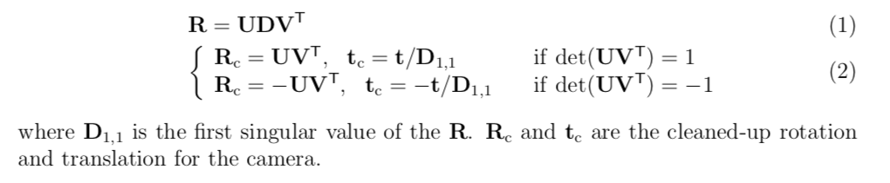

# Multi-View Geometry


---

## 一、对极几何

（就是上一周where am I?中的case2）


### （一）概念

基本原理：**点到线的转换，左图像中的每个点对应右图像中的一条极线**


概念|定义|
---|---
极点|图像中极线的交点（左光心为右图像的极点，右光心为左图像的极点）|
极线|图像中过极点的线（左光心射线为右图像的极线，右光心射线为左图像的极线）|
||**左图中的不同点在右图中形成不同极线**
极平面|两个极点以及空间中的一个点确定的平面，可以有无数个极平面|
基线|两个极点的连线|
||这两张图像的**所有极平面都过基线**，且**基线与两幅图像平面的交点就是极点|


### （二）本质矩阵$E$：
    
1. 特征匹配找出至少8对点
2. 将左相机坐标系作为世界坐标系，则得到一个对极约束
    
    

    
- 两个投影矩阵：$P_1,P_2$
- 三个向量：
    （1）$t$为在右相机坐标系下的平移向量，也是基线方向
    （2）$X_1$为该点的左相机坐标，也就是它的世界坐标
    （3）$X_2$为该点的右相机坐标
3. 三个向量确定一个对极面，任意两个叉乘得到该对极面的法向量，第三个与法向量垂直（点乘得零），由此推出对极约束$$X^T_2EX_1=0$$   $$E=[t]_{\times}R$$其中$[t]$为$t$的反对称矩阵
     
     


4. 极线：$EX_1,X_2^TE$ 
    
    

    


5. 极点：$e_1$为左图中的极点，$Ee_1=0$就是说$e_1$就是右相机光心位置，右图极点同理
    
    

    
    

    
###（三）基本矩阵$F$
 
1. $X_1,X_2$为空间中的同一点的两个相机坐标，通过$K$转换到像素坐标$x_1,x_2$
   $$\begin{cases}x_1=KX_1\\x_2=KX_2\\\end{cases}$$


2. 将像素坐标带入对极约束$X_2^TEX_1=0$得到：

    $$x_2^{-1}K^{-T}EK^{-1}x_1=0$$将中间的矩阵合并为$F$，即$$F=K^{-T}EK^{-1}$$


---

**总结**：

- $E$只描述两个相机空间位置关系：$$X_2^TEX_1=0$$
- $F$描述两幅图像之间的关系（包括相机空间位置关系以及相机投影）：$$x_2^TFx_1=0$$

---

###（四）八点法计算$F$

1. $F$有九个自由度，除去尺度还有8个未知量，又因为$rank(F)=2$，一对点提供$F$的一个约束，所以至少需要8对点来算$F$，用LS解，约束矩阵$A$维度为$8\times9$


2. LS得到的$F$不一定满足$rank(F)=2$，用svd清理


八点法步骤总结：


- where is epiple line？
    左图中一个点$x_1$，对应右图中一条极线$L_2$，将$L_2$归一化就得到这条极线的方向向量。右图点同理
    


- where is epiple？
    左图的极点就是$F$的零空间，比例变换使最后一维为1


    
右图的极点就是$F^T$的零空间，比例变换使最后一维为1
    


###（五）对极约束解法

#### 1. 两张图像特征点匹配，八点法计算$F$，再由$F$得到$E$
    
$$E=K^TFK$$
    
#### 2. $t$就是右相机坐标系下看世界原点（也就是左相机光心），也就是$E$的左零向量。
    
所以svd（$E$）得到的$U$的最后一列$u_3$就是$t$或者$-t$，因为尺度不确定
    


#### 3.$R$可以通过从$E$中分离$t$得到，分离过程


蓝色方块实现了$[t]_{\times}$：$U^T$将$R$转换到一个由$u_1,u_2,t$定义的临时坐标系中；在这个临时坐标系中，三维方阵将$t$方向上的元素置零，即消除了$t$，然后在$u_1,u_2$平面上旋转了$90^\circ$？？？？；$U$将结果重新转换回原来的坐标系中
    

通过一个旋转了$90^\circ$的旋转矩阵$Y$，根据svd相等解出$Y$的两种可能解，然后就能重建$R$


#### 4.$t$有两个解，$R$有两个解，所以共有4组位姿解


    
   **别忘了检查：if ($det(R)=-1$), then($t=-t,R=-R$)**

#### 5. 根据四组解，分别三角化出$3D$点云，选择使这些$3D$点中深度为正的点数最多的解作为$R,t$，同时也得到了三维重建的点云

- 深度为正就是$3D$点的世界坐标第三维$Z>0$，等同于在第一个相机位置的前方
- 不能保证全部深度都为正是因为特征匹配存在噪声


    
6. 第二个相机的世界坐标$C$不是直接等于$t$，$t$要经过旋转矩阵转换到世界坐标系下才是$C$


    
    
### （六） 三角化

**已知一点在两张图像（或以上）的像素坐标，也已知两张图像之间的位姿$R,t$，求点的世界坐标**

#### 问题描述


原理：$3D$点就是所有图像中该点的像素坐标投影到相机空间时光线的交点，最少两条光线就能确定了，多条光线就用LS解


$X$有三个未知量，$rank(A)=2$，所以最少需要2张图像（2个像素坐标）$x$来计算世界坐标$X$；多于两张图像时，用LS解

#### 应用：
 
- 双目相机的$3D$重建：双目的两张图像就是纯平移关系


    
- 对图像中所有的点应用三角化，就是三角重建


---

**总结**
三角化与PnP互为逆过程，PnP是从世界坐标求相机位姿，三角化是从相机位姿求世界坐标


```flow
st=>start: 已知两张图像
op1=>operation: 八点法得到F
op2=>operation: E=K^{T}FK
op3=>operation: svd(E)得到四种解
cond=>condition: det(R)=-1
op4=>operation: t=-t,R=-R
op5=>operation: 三角化，得到正确的位姿R和t，以及3D点云
end=>end: end

st->op1->op2->op3->cond
cond(yes)->op4->op5->end
cond(no)->op5->end
```


---

## 二、RANSAC在$F$求解中的应用

RANSAC在对极几何中用在特征匹配之后去除误匹配的点

- 步骤：
    1. 随机选8个点，计算出$F$
    
    2. 根据对极约束，从左图的特征点画出右图上对应的极线，看右图上的匹配点与极线的距离在不在允许范围内（1到2个像素），误差（也就是距离）计算如图：

    

        
    3. 数内点（匹配成功）的数量
    4. 重复前四步，选出内点个数最多的一个解，除去不支持这个解的外点


## 三、非线性最小二乘

### （一）线性LS与非线性LS

1.线性LS

- 两种形式：


- 性质及解法：解唯一、解收敛（一定有解）、解决方法svd、与初始点（迭代起点）无关


2. 非线性LS

有多个局部解，所以初始点不同可能导致不同的解

### （二）Non-Linear Ls两个用例

#### 1. PnP


直接用线性LS解出的$P$是把$R,t$当作无任何附加约束的未知量来求的，没有考虑到$R\in SO3$的约束（$det(R)=1$和$r_1,r_2,r_3$互相正交），这些约束是非线性的，所以非线性LS就是将这些非线性约束加入LS中，使得解同时满足线性和非线性的约束

#### 2.三角化


当无噪声时（无畸变和误匹配），所有光线都相交于空间中的同一点
当有噪声时，会有多个交点，这时要用非线性LS


原理：**最小化重投影误差**（在像素空间中，不是世界坐标！）

因为前两维要除第三维使得点在图像上，这里就有了非线性的约束


使所有的点重投影误差最小，就形成了一组非线性最小二乘误差方程

### （三）非线性LS解法

二维非线性LS问题：已知相机距离五个点的距离，求相机在平面上的位置


- $f(x)$是一个$m$维向量，$m$是约束的个数，这里$m=5$
- $x$是$n$维向量，$n$是未知量的个数，这里$n=2$

1. 列出cost function，计算平面上所有位置的cost function的值，得到一个高低起伏的三维曲面


2. 为确定曲面的最低点位置，想象自己是一只蚂蚁在面上爬，需要解决两个问题：
    （1）如何识别（全局or局部）最低点？
        最低点的梯度为零，即cost function的导数为零
   
   

        
        
        
    导数公式中含有3个元素：
    
    - Jacobian matrix是非线性函数向量的一阶导数矩阵，维度为$m\times n$（对$n$个未知量有$m$个约束/测量），这里为$5\times2$维，意义是当蚂蚁在平面上移动时，$f(x)$的梯度如何变化（$f(x)$的值对每个未知量、每个约束有怎样的变化，一列对应一个未知量，一行对应约束）
    - $f(x)$想象成$x$位置对应的曲面海拔
    - $b$是常量
    
    （2） 如果不在最低点，要怎么走？
    设一次要走$\Delta x$
    - 确定方向；检查所有方向的梯度，选择梯度下降最大的方向走
    - 确定步长：用泰勒展开将$f(x+\Delta x)$近似为$\Delta x$的线性函数 ，再带入cost function的导数方程中，就得到了线性LS，正规方程解出$\Delta x$就知道往哪走以及走多少了


    
- **问题2说明怎么走，问题1说明什么时候停**

- 由于不同的初始点会收敛到不同的终点，所以为了确定全局最低点，**应选多个初始点进行迭代**

---

**总结：非线性LS三步法**


---

## 四、光流法：$2D$匹配

**追踪微变动$2D$图像中点的运动**

在$t=0$和$t=1$时刻分别拍下一张照片，只是简单的平行于像平面的平移，且只根据亮度进行匹配，把图像想象成一个根据亮度不同起伏的曲面


所以只要找到一个二维平移量$d$使得两张亮度相差最小，两张图像里的每对像素都提供一个约束，因为亮度是关于像素的非线性函数，所以这是一个非线性LS问题


### （一）三步法解非线性LS 
  


#### step1：最低点应该是周围一圈的梯度都不是零，只有最低点是零

红色代表亮度差为正，蓝色代表亮度差为负，绿色代表亮度差为零


    
#### step2：意义是图像左右、上下移动按什么比例混合可使亮度差最小，但这一步并不是真正移动了图像，而是相当于按比例混合重新画每一个像素

- 对于单个像素，$d$有2个未知量，每个像素提供2个约束


    
如何混合左边的图得到右边的效果，第一行主要看左一图知$d_x<0$，第二行主要看左二图知$d_y<0$
    
- 对于所有像素，将每个像素相加
  


#### step3：真正移动图像，多次迭代使图像一步步接近原图


### （二）窗户的例子


不断从新帧中追踪窗户角点的新位置就能获得相机的运动信息


## 五、光流法：$3D$速度矢量匹配

**视频帧之间为连续变动，可以用光流法代替点匹配来sfm**


### （一）光流与相机运动

在多张序列图或视频的连续帧中，按照亮度追踪像素形成光流，能看出相机运动

- 纯平移：整个光流场呈放射状，周围光流长，中心光流短，相机前进方向在FoE


- 纯旋转：所有光流几乎都水平，且两边更长一些


- 绕光轴旋转：整个光流场呈涡流状，靠外的长，旋转轴上光流的长度为零


- 平移加旋转：


### （二）计算光流


#### 1.光流方程


相机平移旋转分别是$V$和$\Omega$，以相机为参考系，空间中一点从$P$移动到$P'$，在图像上从$p$移动到$p'$

- $P'=-\Omega\times P-V$，因为点的运动就是相机运动的反过程

- $p'={P'\over Z}-{Z'\over Z}p={{P'-Z'\times p}\over Z}$，因为相机运动之后点的深度也变了，所以$Z'p$是把$p$投射到与$P'$同深度的位置，再求差才是点相对于相机的位移，然后在乘$1\over Z'$将$P'$投射到图像上形成光流


- 下面两张是从地平线截取的光流场
    - 纯平移时地平线上的点几乎不移动，FoE在地平线上某个位置
    - 纯旋转时所有地面上的速度矢量方向长度都一样
    - 由图和公式可知，**旋转的速度矢量与深度无关**


深度已知时，这是一个线性方程，6个未知量（$V$3个$\Omega$3个），则至少需要3个不共线的光流来解，得到6个线性方程

#### 2.由纯旋转光流场求$\Omega$


#### 3.由纯平移光流场求$V$


##### 方法一：

任取两个不共线光流的交点就是FoE（像素坐标），就得到了相机纯平移的方向
当$V_Z=0$时FoE在无限远处，说明相机移动方向平行于像平面


 
 平移光流$p'_{trans}$就表示成第一个式子
 


- $Z\over V_Z$是距离除速度，可以用来估计相机撞上障碍物的时间，两只眼睛无重叠的动物就这样判断碰撞时间的
- 在图像上与FoE距离相等的点，如果深度一样，则碰撞时间也一样

 
##### 方法二：


$(p\times V)$是向量$p$与向量$V$（从光心指向FoE）的旋转向量，与平移光流$p'_{trans}$垂直
**平移光流$p'_{trans}$与速度$V$相交于点$p$**

$V$有三个未知量，至少需要2个点解出$V$，但只能确定相机移动的方向（即FoE的方向），不能知道具体移动速度，有多个点时用LS


#### 4. 复杂光流场

相机运动都是复杂的，平移和旋转结合的，光流场复杂，但是可以大致识别FoE的位置


- 解决方法：将每个光流分解为两个分量：
    - 平移光流分量：以FoE为中心放射（蓝）
    - 旋转光流分量：平行于地平线（红）


- 光流分解方法：

将光流方程分解成一个包含$V$的矩阵与一个包含$\Omega$和深度的向量相乘的形式，则知道$V$就能求$|omega$和$Z$，知道$\Omega$和$Z$就能求$V$


如何同时求$V$和$\Omega$？
将$\Omega$的向量表示成$V$矩阵的伪逆乘光流，再带回去，就得到了一个只与$V$有关的LS方程
前提是**要计算FoE所有可能在的位置，$\Phi(V)$的伪逆是否存在！**


## 五、BA

**已知很多张图像，同时求$3D$点云和相机位姿**

对极几何通过两张图像得到$3D$模型和相机位姿，很多张图像时用BA来得到$3D$点云和相机位姿


### BA步骤

#### （一）问题模型

已知：$F$张图像中，每张图像中有$N$个点，记作$(x_p^f,y_p^f)$
求解：相机位姿$R^f,T^f$，点的世界坐标$X_p=(X_p,Y_p,Z_p)$


1.列出投影方程：因为$K$已知，可列出两个投影方程
2.将第一帧的相机坐标系作为世界坐标系
3.因为尺度不确定，一般将第一帧到第二帧的位移作为尺度1，或者自己定义一个尺度


- 未知量一共有$6(F-1)+3N-1$个：$F-1$张图像的位姿，每个位姿3个平移3个旋转，$N$个点每个点3个未知量，再减去1个尺度
- 方程一共有$2NF$个：$F$张图像，每张图$N$个点，每个点提供$2$个方程

为了有确定解，方程数$>$未知量数


#### （二）解法

1. 一般点很多，应该充分利用这些测量，所以将解方程转换成一种优化问题，使得大多数的测量都能起到作用

**BA思路：寻找$R^f,T^f,X_p$，使重投影误差$\epsilon$最小**


($C$是$\epsilon$和$\epsilon^T$之间的协方差，不管）

2.建立需要优化的目标函数$\Phi(u)$，等于误差的内积（向量的内积等于模长的平方），这是一个非线性LS

（1）用泰勒展开（回顾非线性LS那节）


（2）**Gaussian-Newton法**解决非线性：忽略Hessian中的二次项，直接取$H=J^TJ$


得到解$\delta u$作为步长（红色是高斯牛顿法，绿色是梯度下降法，看到红色更快）


3.BA要解决如何转化$J^TJ$
    (1)将未知量分为两个向量
        - 位姿未知量$a$，$6F-6$维
        - 点坐标未知量$b$，$3P-1$维
    先看2张图像3个点的情况，一共$a_1,a_2,b_1,b_2,b_3$五个未知
    （2）写出$J$
 


（复习：Jacobian matrix是$m\times n$维，$n$个未知量$m$次测量）
这里2图3点，$J$的维度：
    - $n=2\times 3+3\times 3=15$
    - $m=2\times 3=6$

(3）写出$J^TJ$
 


（4）清除$J^TJ$中的非对角元素$W$，小技巧：（*图中式子有错！左右同乘的矩阵右上角元素少了一个负号！*）
    


这样就得到了两个方程，其中第一个方程中只有$a$，这就可以先求出相机位姿$a$，再带入第二个方程求出$3D$点坐标$b$
    


## 六、VO

VO与BA很像，只不过BA的图像可以不是连续的，VO更注重于恢复出相机的连贯运动轨迹

- 两种VO的方法：
    - 特征点法：提取特征点，计算描述子，对极几何求解位姿
    - 直接法：光流法，利用图像中所有的像素的亮度，仅依靠优化（最小化光度误差）求解位姿（就是怎样摆相机能使两张图像亮度分布最接近）
    - 半直接法：提取角点，不算描述子，仅依靠优化求解位姿

### （一）VO问题模型

与BA一样，$k+1$张图像，恢复$k$个位姿


### （二）更新位姿

分为两步

#### 1.更新$R$


1. 获得一张新图像，先特征匹配，RANSAC去噪
2. 对极几何（5点法）算出$E$，解出$^kR_{k+1},^kT_{k+1}$
3. 将新的旋转加到当前相机位姿上得到$R_{k+1}$

*为什么用对极几何而不是PnP：VO主要偏重pose而不是pointcloud，SLAM中既关心pose也要pc，所以第一二帧之间用对极几何，后面都用PnP*

#### 2.更新$X_p$和$T$

由$E$解出的$^kT_{k+1}$因为尺度不确定，所以不能直接加到相机上


1. 三角化，更新$3D$点云$X_p$
2. PnP算法解出$^kT_{k+1}$，这里可以同时更新$R$和$T$，也可以只更新$T$


### （三）VO中用到的优化方法


#### 1.BA：减小位姿的累积漂移


时不时选取几张图像为一组，一起BA

- BA的好处：
    - 可以有更长的基线（一组图像内相机移动距离更远）
    - 最小化重投影误差时可以直接通过投影方程把所有的未知量同时优化

- BA中未知量的更新顺序


3和5说明相机的速度$v$和角速度$\omega$都是常量


#### 2.Keyframe：减小投影误差（针对$3D$点云）

三角化重建$3D$点云的时候会有投影误差，通过关键帧筛选减小了投影误差，优化了$3D$点云


当相机移动基线变长，可以从另一个视角去看的时候，就能把投影误差减小，小到一定程度后可以用这个解来更新$3D$点云了


可以更新$3D$点云的帧提取为关键帧

#### 3.三点法：去除错误的位姿

可以用5点法的RANSAC，不过会花费大量时间在内点的筛选上，3点法RANSAC更快

- 三点法
    1. 要求已知相机的一个方向
        - 比如从陀螺仪确定了重力方向
        - 或者从灭点确定了世界坐标两个轴的方向

    2. 由已知的方向可以确定相机旋转中的绕$x$和绕$z$的旋转分量，这样只剩下3DoF（自由度）
        - yaw（绕$y$轴的旋转分量）
        - $T$的两个未知量
    
 


    3. 由三个点就可以得到含有4个未知量的4个方程


#### 4.回环检测：使轨迹整体统一

分为两步


### （四）其他与视觉融合的里程计项目

#### 1.视觉+IMU

由IMU获得的加速度和角速度，可以以米$m$为单位计算相机位姿，也就是解出了VO中自定义的global scale

#### 2. Libviso

libviso2 (Library for Visual Odometry 2) 是一个快速跨平台C++库用于计算移动单目/双目相机的6DoF运动。

#### 3.SDVO

Semi Direct Visual Odometry半直接法，


## 七、BA

### （一）单视角、单个点的重投影误差

- 原理：最小化重投影矩阵，注意是对图像内重投影误差进行优化，即二维像素级别，不是三维相机坐标


    
- $m～$是图像上特征点的位置
- $m$是$3D$世界坐标$X$通过投影矩阵$P$投影到图像上的重投影点的位置

重投影误差方程是线性的，但是含有非线性的约束（$u,v,w$之间的约束、$SO3$对于$R$的约束），所以这是一个非线性优化问题

#### 1.步骤：

1. 将闭合形式（重投影误差方程）转化成优化问题（LS形式）


- 其中$R$用了四元数形式
- 构成了LS的第一种形式

2. 两步法解非线性LS

- ”求导=0“得到判断最低点的条件
- 泰勒展开得到线性近似，求出$J$，然后就能用正规方程解出步长$\Delta x$，确定每一步怎么走


#### 2.如何求$J$

$J$是投影矩阵（就是这里的$f(R(q),C,X)$）对每个未知量求偏导组成的一阶导数矩阵，求出$J$扔到正规方程中就能解出$\Delta x$了


- 首先看$J$的形式：$m\times n$维，$m$个约束（测量），$n$个未知量，所以有

    - $q$：$R$的四元数形式，4个未知量
    - $C$：光心的世界坐标，3个未知量
    - $X$：点的世界坐标，3个未知量
    - 2个约束：像素坐标，一个约束行$x$，一个约束$y$


    
- 链式法则
    


    
    每一块的具体形式
    
    图25 26 27 29
    


    
### （二）多视角、单个点的重投影

一个点提供了一个$2\times 10$的$J$，多个点的$J$是所有视角的$J$组合

#### 1.两视角、一个点


中间为0的部分是因为，Bob与Mike的$R,C$互相独立（互不影响）

#### 2.三视角、一个点（$2D$例子）

其中虚线代表重投影，BA可以同时变动相机位姿和点的坐标，使得三条投影线准确地在点的位置相交
这里我们只举例如何调整点的坐标这一个量
    


1. 每个相机的$J$是$1\times 3$维

- 对于每个相机有三个未知（$x,y,\theta$)
- 一个点提供一个约束（因为$2D$所以只能投影出点在相机$x$方向上的位置）

2. 由于这里只优化点坐标，所以只去点的部分


- $J$中的元素的意义：比如第一个元素，它在图像上所有的位置时，在$X$方向上变动在第一个相机上投影位置的变动大小，绿色表示投影变化小，红色表示大
    


其他元素同理


类似地分析未知量之外的所有量


#### 3.三视角、两个点


只调整point 1时


只调整point 2时


只调整camera 1时


## 八、SfM总结

**已知很多张连续图像，求解相机位姿和$3D$点云**

---

### 1. 第一张和第二张特征匹配

两步：

- 特征提取，包括描述子
- 匹配

### 2.RANSAC去除错误匹配，同时得到$F$

- 任选8个点，根据对极几何，8点法解$F$


- 用这个$F$将左图的点转换成右图的极线，看有多少内点


### 3.从$F$中去掉$K$得到$E$


### 4.恢复相机位姿$T,R$

- svd($E$）得到$T$
- 求$R$
- 得到4组解


### 5.三角化得到点云$X$


### 6.加入新帧，PnP求新的相机位姿

直接$2D$与$3D$（新图像与已知点云）匹配，快速得到新的相机位姿


注意：svd分解得到V取最后一列，要reshape成4*3维！！看图上注意未知数P的位置！



R，T要做处理！！

### 7.BA，在多张图像中最小化重投影误差，一起优化对于位姿和点云的估计


---

- 实际计算$H$逆的方法：由于特征点和相机位姿很多，所以$J$会很大，而特征方程需要求$J$的$H$逆，计算量太大，所以实际中用别的方法求$H$逆


